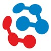
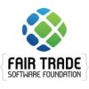

# About me

I am a web application developer with a focus on the frontend. I have a passion for teaching other people and sharing knowledge. Other passions of me include electronics and embedded microcontrollers.

Another thing I am a fan of is open source software. One of the groups projects I participated inside was the Charcoal project, which is a project that helps to keep the StackExchange network clean from spam. This project was written in Python, with the web interfaces being written in Ruby on Rails.

## My career

The value I bring to a development team comes from the fact that I likes to
share knowledge. This means I can teach junior programmers the in and out of
the systems used in the company. Teaching other people skills is something I
like and really useful in the world of open source software. This also explains
why I like to help other people on website such as StackOverflow or Reddit.

### Work places

#### Competa

*From <time>2017-08</time> till <time>2024-09</time>*

Competa is a company that specializes in sending programers to other companies. At this company, not only did I work for external projects, I also participated with the internal projects.

##### Zorgverkeer

*From <time>2020-03</time> till <time>2024-09</time>*

Zorgverkeer is a company that works together with healthcare and departments in the Netherlands. They help facilitate the exchange of information between both parties and offer a platform to do so.

###### Hub

The hub is a central database for reporting, it allowed my manager to make their own reports and show them to the end users.

Challenges of this project were performance. Some reports had over a million rows, so I had to invent virtualized tables in the frontend end and streaming of the json in the backend, so the users would see a working application. Other challenges were the fact that the project has to facilitate being fully dynamic in regards to the data in the UI tables.

###### Healthcare provider tool

This tool allowed health care providers to monitor their budgets and make invoices to be send to the municipalities.

The project was started by another developer in JavaScript, I was part of the team to convert it to TypeScript, as the existing code showed many issues coming from the fact that it had grown too big and there were many type issues.

###### Portaal

This is another tool for managing data of health care providers, it allows them store data about the providers them selves, which acts as a central database.

##### Royal Has Koning

*From <time>2014-07</time> till <time>2017-07</time>.*

At this place, my role was helping with the inhouse projects. The tech stack over these projects varried, but my team was the same group.

###### Calculation api

For this customer, we had to convert an excel sheet into an web api, which was capable of doing calculations related to the energy usage. It had to calculate some parts hourly, while other parts were calculated just once, we had to build a framework so you could easily code the calculations in NodeJS using vanilla JavaScript

###### Floorplan visualizer

This was a project using [ThreeJS](https://threejs.org/) for visualization of the floorplan of a building. It allowed you to drag and drop furniture to the room. It also had an auto layout feature that used an algorithm in the backend to generate a furniture floorplan for you. This project was codes using VueJS and vanilla JavaScript.

This project was never finished and the funding dried up.

###### Mooring line force tool

This tool uses a geographic calculation to calculate the forces on mooring lines that ships experienced during multiple wind and water flow conditions, this helped to see if the configurations were within the safe operation limits of the equipment. 

###### The website v3

This was a website version written with NextJS. I joined the project pretty late, which meant I was not responsible for making chooses in this project. Even with this setback, we still made a good looking website.

###### The website v1

This was an version of their website written with wordpress. It allowed people to make blog posts and had a few animations here and there. A tricky part of this website was triangle borders between the components, which never worked great when you were zoomed in.

###### Trainee project

One thing I really enjoy is sharing knowledge. I ran projects to train up other people starting from the near basics till they have more experience to go on projects. This usually started with the HTML basics, then introduced ReactJS and other higher level frameworks.

Teaching other people requires patience and knowledge of the work itself. This was quite fun to do.

###### Fair Trade Software Foundation

For this project, we had to work together with other developers from Kenya. This involved being aware of cultural differences between their cultures and our cultures.

### Internship

#### Competa

During my internship at Competa, I greatly improved my frontend tech skills. This started with AngularJS and eventualle ended up with VueJS skills.

#### Udoc

*From <time>2015-07</time> till <time>2016-01</time>*

UDoc was a company managing the selling of digitalized car manuals. They also
had other websites for digital books. During this internship, I learned to work
with other people in bigger projects.

During this project I had to help with fixing bugs in their website and develop new features.

#### Zadkine

At this internship I was responsible for giving computer courses to seniors that were not yet knowing how to use any computers. After these courses were over, my next task was helping the school upgrade their computers, by moving the old computers to the storage area and bringing and installing the new computers at the desks.

## Education

* <time>2017</time> MBO Application developer level 4 @Id College
* <time>2014</time> MBO Medewerker beheer ICT level 3 @Albeda College
