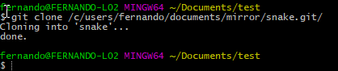

# Making a backup of your GitHub repositories

When working with GitHub, you have the advantage that everything is stored in the cloud. While this is fine for most people, it can be useful to make a local backup in the case you expect to have no internet for a certain period of time, like a vacation.

## Initial backup tool

Lucky for us, [git already has the features build in](https://git-scm.com/docs/git-clone#git-clone---mirror) to effectively mirror a remote repository using the mirror flag, so the only thing left for us, is getting a list of repositories to clone.

This time, we can use the GitHub API to retrieve this list. We just need to call the repositories endpoint: `https://api.github.com/users/<username>/repos?per_page=100`, since this needs a username, let me use [mine]( https://api.github.com/users/ferrybig/repos?per_page=100) for the remaining of the article. Fetching the API using `curl`, we can see that it returns human readable Json files. Because these files are human readable, we can easily use text parsing tools to parse it. We start using `grep` to filter on text containing `clone_url`, and [after running this](https://gist.github.com/ferrybig/5e62bffd15ac6c49dfde871e14fa2d79) it seems like we have a good list of repositories.

We notice that our list still contains some unneeded characters that came from the Json file, so we need to cut them away. We will use the tool `cut` for this. We need to set the delimiter to `"` and we need to select the fourth field. We call cut like the following: `cut -d'"' -f4`, so we have the following command line:

```sh
curl https://api.github.com/users/ferrybig/repos?per_page=100 | grep clone_url | cut -d'"' -f4
```

This gives us a nice list, containing only the git URLs. We only need to use git to mirror these repositories. Of course, we don't want to start git manually, so we use xargs to start a git instance per line. We do this using `xargs -l 1 git clone --mirror`, our final command now looks like:

```sh
curl https://api.github.com/users/ferrybig/repos?per_page=100 | grep clone_url | cut -d'"' -f4 | xargs -l 1 git clone --mirror
```

## Incremental mirror

While this works greats for the Initial backup, we experience problems if we try to use it as a Incremental backup, as git refuses to clone to a directory that already contains files.

We are going to solve this by making a small shell script that tries to fetch if the directory already exists, we can get the directory from the git url using the [`basename`](https://linux.die.net/man/1/basename) tool. We need to replace the xargs call by a subshell call, so we don't need to create a new shell every time, this is crucial for our performance, especially when running on Windows based platforms.

```bash
curl https://api.github.com/users/ferrybig/repos?per_page=100 | grep clone_url | cut -d'"' -f4 | while read url;
do
  project="`basename "$url"`"
  echo "Mirroring $project"
  if [ -d "$project" ]; 
  then
    cd "$project"
    git fetch --prune
    cd ..
  else
    git clone --mirror "$url" "$project"
  fi
done
```

## Dealing with pagination

Since it's usually inefficient to return a large number of results on a single page from the back-end perspective, the GitHub API uses pagination.

While most people can just set the `per_page` variable to 100, some people have more repositories than that. Because of this, we need to introduce yet another while loop that loops over the different pages, looking at the documentation of the GitHub api, we can see that it exposes a "next" field inside the headers. To access these headers easily from our script, we can read those headers from a [header file](/tech/curl-header-file), yet another feature of curl.

This features requires however an temporary file, since we don't have any output streams left for this, and because Windows doesn't handle self created one always correctly. To create an empty file, we use the command [`mktemp`](https://linux.die.net/man/1/mktemp). This command makes an empty file at the standard location (`/tmp`). We also need to make sure that at the end of our script, that this file is deleted properly, to make sure that we don't leave any garbage behind.

We also need to introduce a while loop and an variable containing an url, so we can keep on looping till GitHub says we have seen all the pages.

```bash
#!/bin/sh
tmp="`mktemp`"
url="https://api.github.com/users/ferrybig/repos?per_page=100"
while [ ! -z "$url" ]; do
  echo "Fetching $url..." >&2
  curl --dump-header "$tmp" "$url"
  url="$(< "$tmp" grep link | grep -oE "[a-zA-Z0-9:/?=.&_]*>; rel=\"next\"" | cut -d'>' -f1)"
  echo "Next url: $url" >&2
done | grep clone_url | cut -d'"' -f4 | while read url;
do
  project="`basename "$url"`"
  echo "Mirroring $project"
  if [ -d "$project" ]; 
  then
    cd "$project"
    git fetch --prune
    cd ..
  else
    git clone --mirror "$url" "$project"
  fi
done
rm "$tmp"
```

## Accessing our mirror as a normal repository

Since the purpose of a mirror is that we can also access the information locally, we will demonstrate how to do this.

Instead of accessing our git repository using the normal browser way (so git over https), we now need to access it over the file protocol. With cloning, it is as simple as `git clone /home/Fernando/mirror/neuralnetwork.git`(Linux), or `git clone /c/users/fernando/documents/mirror/neuralnetwork.git`(Windows). (Notice that relative paths are also supported, but they will break when moving your repository around, and some editors have bad support for this, so I ill advise this)



Sometimes, you only want to use this trick to bring your local repository up to date, without having to reclone it, this can be done using git pull as follows: `git pull /home/Fernando/mirror/neuralnetwork.git`. for the default branch, or `git pull /home/Fernando/mirror/neuralnetwork.git feature/nn-001`, this is really useful if you forgot to pull before isolating yourself from the internet, but made the mirror anyways.

In the case you want to copy multiple branches, it doesn't make sense to pull them in, instead we add our mirror as a remote, like so: `git remote add mirror /home/fernando/mirror/neural-network.git`, followed by `git fetch mirror`. After doing so, we can now use the normal git commands to explore the mirror as a real repository, however care should be taken that you don't push accidentally to the repository in question, because those commits will be overridden, the next time when you update the mirror again.

## Wrapping up

After reading the above step, we have learned that github has a really easy api to work with, even when you don't have json based tools, and that git has really powerful commands buildin.

We also learned how to use common command line tools like `cut` and `grep`,  so we can use them in the future.

And finally, we discovered that working with local repositories is basically exactly the same as working with online repositories, and that git fully supports running with this configuration.
