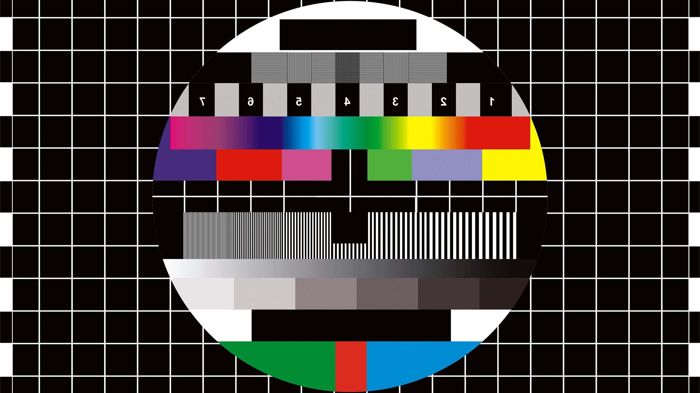

    {
        "date": "2020-03-15",
        "tags": ["blog", "portfolio", "skills"],
        "extraTags": ["webpack-loader", "jsx"]
    }

# My new website

If you read this quickly after publication, the chance is high you are on my newly build website. The are multiple techniques used on this website to archieve my goals. My goals for this website were:

  * Static HTML pages
  * Minimal javascript
  * Automatic compiling of markdown posts
  * Dark/white theme support based on the browser, with user override
  * Quick load times

Skills learned

  * [Writing my own webpack loader](https://www.npmjs.com/package/json-tagged-file-loader)
  * Using JSX without depending on React

Test: *italic?*  **bold?**

We can also embed image into the markdown files, as shown below:



Code blocks are highlighted:

```typescript
export function createElement(type: string | ((props?: any) => JSX.Element), props?: any, children?: any): JSX.Element {
	return {
		type,
		props: {
			children: children ?? undefined,
			...(props ?? {}),
		},
		key: null,
	};
}

export const jsx = createElement;
export const jsxs = createElement;
```
