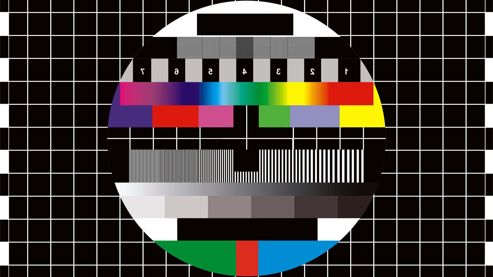

# My new website

If you read this quickly after publication, the chance is high you are on my
newly build website. The are multiple techniques used on this website to
archive my goals. This was quite a technical challenge to do, but I managed this.

## Goals

* Static HTML pages
* Minimal javascript
* Automatic compiling of markdown posts
* Dark/white theme support based on the browser, with user override
* Quick load times
* Contribution graph like github

## Skills learned

* [Writing my own webpack loader](https://www.npmjs.com/package/json-tagged-file-loader)
* Using JSX without depending on React

## Blog post supporting markdown

This blog post support *italic* and **bold** text, because of the markdown
engine on the background.

We can also embed image into the markdown files, as shown below:



Code blocks are highlighted: (And it works with dark/light mode without any
javascript that is reran)

```typescript
export default function assertNever(input: never): never {
    throw new Error('Expected never, got: ' + JSON.stringify(input));
}

```
